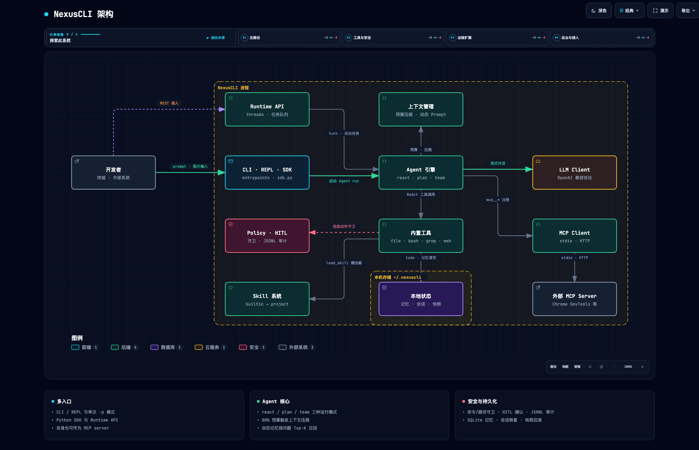

# NexusCLI

**运行在终端里的 AI Agent CLI，面向真实项目开发场景**

读写文件 · 搜索代码 · 执行命令 · 联网检索 · MCP 工具 · 记忆 · 快照 · Runtime API


[交互式架构图](docs/architecture.html) · [运行教程](TUTORIAL.md) · [快速开始](#-快速开始)

---

NexusCLI 不是一个空壳 Demo，而是按真实 CLI 产品来做：核心路径有测试覆盖，也经过本地 smoke 和真实终端运行验证。

> 第一次部署？看 [TUTORIAL.md](TUTORIAL.md)：从安装依赖、配置模型 API 到第一次跑通 Agent 任务的完整运行教程。

## 📐 架构总览

[](docs/architecture.html)

上图为静态快照，[交互式版本](docs/architecture.html) 支持节点搜索、路径追踪、引导式故事和深浅色主题（按 `?` 查看操作指南）。图表源文件是 [docs/architecture.json](docs/architecture.json)，交互 HTML 由 [Archify](https://github.com/tt-a1i/archify) 从该源文件生成。

一条主路径贯穿全局：**开发者** 通过 **CLI / REPL / SDK** 发起会话，**Agent 引擎** 按 `react / plan / team` 三种模式驱动，经 **上下文管理** 组装 Prompt 并压缩预算，与 **LLM** 流式对话，并通过 **内置工具** 与 **MCP** 操作本地系统和外部世界；所有危险动作都要经过 **Policy · HITL · 审计** 才会落盘。

## ✨ 功能特性

### Agent 运行模式

- 交互式终端 Agent，基于 Rich 和 prompt-toolkit 渲染；也支持单次 prompt 模式，适合脚本、管道和自动化调用
- ReAct 工具调用循环，支持 thinking、tool call、tool result、final output 和 usage 事件
- Plan-and-Execute 模式：独立 Planner 生成 DAG，按依赖批次并行执行任务
- Multi-Agent 协作模式：Planner、Worker、Reviewer、依赖调度、并行 worker、review 重试，以及可切换到独立 Plan-and-Execute 的子 Agent

### 模型与上下文

- OpenAI-compatible 流式 LLM 客户端，默认面向 DeepSeek 配置，支持 `DEEPSEEK_API_KEY` 等 provider-specific API Key
- 上下文预算与压缩：达到可用输入预算的 80% 后压缩旧轮次，保留近期消息和完整工具调用对
- 完整 usage、缓存命中/未命中 Token、reasoning Token 和可配置成本估算
- 本地图片和远程图片输入，并根据模型能力自动降级

### 工具与扩展

- 内置文件、Shell、grep、glob、记忆、网页搜索、网页抓取、代码搜索等工具
- MCP client，支持 stdio 和 Streamable HTTP MCP server；附 Chrome DevTools MCP 配置助手
- NexusCLI 自身也可以作为 MCP server 暴露内置工具
- Skill 系统：builtin / user / project 分层、输入 Top-K 匹配、`load_skill` 当前回合懒加载，以及经 HITL 确认的 `save_skill` 流程沉淀
- 自定义斜杠命令：把 markdown 提示词放进 `~/.nexuscli/commands/` 或项目 `.nexuscli/commands/` 即可扩展 REPL 与 `-p` 模式

### 记忆与持久化

- 静态项目记忆 + SQLite 动态长期记忆：元数据、去重、TTL、容量治理和相关性召回
- Agent run 前后自动创建快照，支持恢复现场
- REPL 会话自动持久化为 JSONL 转录，支持 `sessions` 列表、`-c` / `--resume` 跨进程恢复，以及 `/resume` 在会话内切换历史

### 安全与治理

- HITL 人工确认、命令/路径安全策略和 JSONL 审计日志
- `save_skill` 等沉淀类操作默认强制人工确认，模型不会静默改变后续行为

### Runtime API

- 有历史的 thread、turn、事件日志，对外提供 HTTP 接入
- 持久化后台任务：原子抢占、租约恢复、取消保护、项目隔离，支持 `react|plan|team` 模式

## 📚 目录

- [架构总览](#-架构总览)
- [功能特性](#-功能特性)
- [环境要求](#-环境要求)
- [快速开始](#-快速开始)
- [配置](#-配置)
- [交互命令](#-交互命令)
- [内置工具](#-内置工具)
- [Skill 匹配与沉淀](#-skill-匹配与沉淀)
- [记忆、动态 Prompt 与上下文压缩](#-记忆动态-prompt-与上下文压缩)
- [模型、Token 与费用](#-模型token-与费用)
- [联网工具](#-联网工具)
- [MCP](#-mcp)
- [Runtime API](#-runtime-api)
- [图片输入](#-图片输入)
- [快照](#-快照)
- [会话与恢复](#-会话与恢复)
- [任务清单](#-任务清单)
- [自定义斜杠命令](#-自定义斜杠命令)
- [SDK](#-sdk)
- [开发](#-开发)
- [License](#-license)

## 🧭 环境要求

- Python 3.11 或更新版本
- [uv](https://docs.astral.sh/uv/)
- 可选：`rg`，用于更快的本地搜索
- 可选：Chrome DevTools MCP 需要 Node.js 20.19.0 LTS 或更新版本、npm/npx 和 Chrome

## 🚀 快速开始

```bash
git clone <your-repo-url>/nexuscli.git
cd nexuscli
uv sync --extra dev
uv run nexuscli --help
```

启动交互模式：

```bash
uv run nexuscli
```

单次查询：

```bash
uv run nexuscli -p "帮我总结这个项目"
```

选择运行模式并输出机器可读的 usage/cost：

```bash
uv run nexuscli --mode plan -p "先读取 README，再验证项目" --json
uv run nexuscli --mode team --worker-mode plan -p "并行审计核心模块" --json
```

检查当前环境：

```bash
uv run nexuscli doctor --cwd .
```

会话持久化与恢复（REPL 对话自动保存，可跨进程继续）：

```bash
uv run nexuscli sessions       # 列出当前项目的最近会话
uv run nexuscli -c             # 继续本工程最近一次 REPL 会话
uv run nexuscli --resume <id>  # 按会话 id 恢复
```

## 🔧 配置

NexusCLI 的配置优先级如下：

1. 内置默认配置
2. `~/.nexuscli/config.json`
3. 项目级 `.nexuscli/config.json`
4. 项目级 `.env`
5. CLI 参数
6. 当前进程环境变量

可以像 Java 项目一样，把 DeepSeek Key 写到项目 `.env` 里：

```dotenv
NEXUSCLI_PROVIDER=deepseek
NEXUSCLI_MODEL=deepseek-v4-flash
DEEPSEEK_API_KEY=your_key_here
```

也可以使用 NexusCLI 通用 Key：

```dotenv
NEXUSCLI_PROVIDER=deepseek
NEXUSCLI_MODEL=deepseek-v4-flash
NEXUSCLI_API_KEY=your_key_here
```

当前支持的 provider-specific API Key 包括：

| 环境变量 | 说明 |
|---|---|
| `DEEPSEEK_API_KEY` | DeepSeek |
| `ZAI_API_KEY` | GLM 官方推荐 |
| `GLM_API_KEY` | GLM |
| `STEP_API_KEY` | StepFun |
| `KIMI_API_KEY` | Kimi |

通过命令行临时覆盖 provider 和 model：

```bash
uv run nexuscli --provider deepseek --model deepseek-v4-flash
```

连接本地 OpenAI-compatible 服务：

```bash
NEXUSCLI_PROVIDER=openai-compatible \
NEXUSCLI_BASE_URL=http://127.0.0.1:11434/v1 \
NEXUSCLI_MODEL=qwen2.5-coder \
uv run nexuscli -p "解释这个仓库"
```

## 💬 交互命令

进入 `uv run nexuscli` 后，可以使用这些 slash commands：

```text
/help
/exit
/clear
/resume
/resume <index-or-id>
/context
/memory
/memory search <query>
/memory stats
/memory delete <id>
/memory clear
/save <fact>
/config
/tools
/hitl default|auto
/policy
/audit [N]
/index [path]
/search <query>
/plan <task>
/team <task>
/team --plan <task>
/model
/model <model-id>
/model <provider> <model-id>
/usage
/skill
/skill list
/skill show <name>
/skill on <name>
/skill off <name>
/skill reload
/mcp
/task
/task add [--mode react|plan|team] <task>
/task cancel <task_id>
/task log <task_id>
/snapshot
/snapshot clean
/restore <snapshot-id-or-index>
```

`/model` 会打开交互式模型选择器：`Tab` 或左右方向键在 `Default`、`Custom` 之间切换，上下方向键选择模型，`Enter` 立即切换当前 Agent。`Custom` 中可以选择已保存的 BYOK 模型、创建新的 DeepSeek/GLM/OpenAI-compatible 配置，或按 `d` 删除配置。自定义配置保存在权限为 `0600` 的 `~/.nexuscli/models.json`；建议填写 API Key 环境变量名，只有显式输入 API Key 时才会把密钥写入该文件。

## 🧰 内置工具

NexusCLI 内置了一组 Agent 可以调用的本地工具和联网工具：

| 类别 | 工具 |
|---|---|
| 文件 | `read_file` · `write_file` · `list_dir` |
| 检索 | `glob` / `glob_files` · `grep` / `grep_code` · `search_code` |
| 执行 | `bash` / `execute_command` |
| 网络 | `web_search` · `web_fetch` |
| 记忆 | `save_memory` · `search_memory` |
| Skill | `load_skill` · `save_skill` |
| 任务清单 | `todo_write` · `todo_read` |
| 会话 | `revert_turn` |

写文件、执行命令、远程 MCP 写操作、恢复快照等危险动作，会经过 policy、HITL 和 audit 处理。`save_skill` 也必须经过 HITL；模型可以提议沉淀，但不会静默改变后续行为。

交互模式下按 `Shift+Tab` 可在两种会话权限模式间切换：

- `Default`：使用启动时的 HITL、工作区路径和命令安全策略。
- `Auto (full access)`：当前会话内不再请求审批，并关闭路径与命令守卫；再次按 `Shift+Tab` 会恢复启动时的默认策略。

## 🎯 Skill 匹配与沉淀

Skill 按 `builtin -> user -> project` 加载，同名时后层覆盖前层：

- builtin：产品默认能力
- user：`~/.nexuscli/skills/*/SKILL.md`，跨项目复用
- project：`.nexuscli/skills/*/SKILL.md`，最贴近当前仓库并拥有最高优先级

每次用户输入先用 name、description、tags 做中英文词法/字符 n-gram Top-K 匹配，再把候选交给模型决定是否调用 `load_skill`。Skill 正文只在真正加载后进入当前 ReAct 的下一模型轮；每个并发子 Agent 都有独立 Skill 缓冲区，不会串线。

当一次成功流程具备稳定输入、明确步骤和可复用边界时，模型可以调用 `save_skill` 提议写入 project 或 user 层。该工具默认拒绝覆盖已有 Skill，并强制人工确认。

## 🧠 记忆、动态 Prompt 与上下文压缩

NexusCLI 把记忆分成三层：

- 短期记忆：当前 thread/session 的原始消息、工具调用和工具结果
- 静态长期记忆：`AGENTS.md`、`NEXUS.md`、`.nexuscli/NEXUS.md` 及自定义 prompt 文件；人工维护、可版本控制
- 动态长期记忆：按项目 scope 隔离的 SQLite 记录；包含 kind、source、importance、confidence、TTL、访问次数和内容哈希

动态记忆不会再无条件取“最近 8 条”。每个请求会按当前问题自动召回 Top-K，并把结果放进明确标注为 untrusted data 的动态 Prompt；模型觉得候选不足时，还可以调用 `search_memory` 深搜。写入端会拒绝空值/超长值，通过规范化哈希去重，并按项目容量淘汰低价值记录。

Prompt 分为可缓存的静态前缀和逐请求重建的动态后缀。静态前缀承载身份、规则和项目指令；动态后缀承载当前时间、cwd、模型、工具以及与当前问题相关的记忆。

可用输入预算按 `context_window - max_output_tokens - reserve_tokens` 计算。默认在该预算的 80% 触发压缩，压到 55% 左右，为后续输出、工具结果和无 tokenizer 估算误差留出空间。压缩摘要只属于短期会话，不会自动晋升为长期记忆。

## 💰 模型、Token 与费用

默认 provider/model 是 `deepseek/deepseek-v4-flash`。DeepSeek V4 Flash/Pro 的内置 profile 使用 1M 上下文，并带有截至 2026-07-17 的官方每百万 Token 价格；价格会变化，因此可以用 `llm.context_window` 和 `llm.prices` 覆盖，未知 OpenAI-compatible 模型应显式配置。

流式请求开启 `stream_options.include_usage`，并解析 `choices=[]` 的 usage-only 块、cache hit/miss 和 reasoning Token。REPL 用 `/usage` 查看最近一次普通 ReAct，单次 CLI 用 `--json` 获取完整 usage/cost。成本以供应商返回的实际 Token 为准，不能只用“代码行数”精确推算。

## 🌐 联网工具

`web_search` 使用 DuckDuckGo HTML 搜索，返回标题、URL 和摘要。

`web_fetch` 可以抓取公开 HTTP/HTTPS 页面，并做基础正文提取。它会拒绝 `file://`、loopback、私有网络和内网地址，降低 SSRF 风险。

如果需要登录态、浏览器状态或 JS 渲染页面，建议使用 Chrome DevTools MCP。

## 🔌 MCP

NexusCLI 可以连接 MCP server，并把远端工具动态注册为：

```text
mcp__<server-name>__<tool-name>
```

初始化项目级 Chrome DevTools MCP 配置：

```bash
uv run nexuscli mcp init-chrome --scope project
```

它会写入 `.nexuscli/mcp.json`，内容类似：

```json
{
  "mcpServers": {
    "chrome-devtools": {
      "type": "stdio",
      "command": "npx",
      "args": [
        "-y",
        "chrome-devtools-mcp@latest",
        "--no-usage-statistics"
      ]
    }
  }
}
```

连接已有 remote-debugging Chrome：

```bash
uv run nexuscli mcp init-chrome \
  --scope project \
  --browser-url http://127.0.0.1:9222
```

查看已配置的 MCP server：

```bash
uv run nexuscli mcp list
```

把 NexusCLI 自身作为 MCP server 暴露：

```bash
uv run nexuscli mcp serve --transport stdio
uv run nexuscli mcp serve --transport http --port 3000
```

HTTP smoke：

```bash
curl -sS -X POST http://127.0.0.1:3000 \
  -H 'content-type: application/json' \
  -d '{"jsonrpc":"2.0","id":1,"method":"tools/list","params":{}}'
```

Chrome DevTools MCP 会把浏览器页面和 DevTools 状态暴露给 Agent。不要随意把包含个人账号、敏感数据或生产后台的 Chrome 会话授权给 Agent。

## 📡 Runtime API

NexusCLI 内置轻量 Runtime API，适合外部系统接入线程、turn、事件和后台任务。

启动服务：

```bash
NEXUSCLI_RUNTIME_API_KEY=dev-key \
uv run nexuscli serve --http --port 8080
```

创建线程：

```bash
curl -sS -X POST http://127.0.0.1:8080/v1/threads \
  -H 'x-api-key: dev-key'
```

发送 turn：

```bash
curl -sS -X POST http://127.0.0.1:8080/v1/threads/<thread_id>/turns \
  -H 'content-type: application/json' \
  -H 'x-api-key: dev-key' \
  -d '{"message":"总结这个项目"}'
```

读取事件：

```bash
curl -sS http://127.0.0.1:8080/v1/threads/<thread_id>/events \
  -H 'x-api-key: dev-key'
```

创建并查看后台任务：

```bash
curl -sS -X POST http://127.0.0.1:8080/v1/tasks \
  -H 'content-type: application/json' \
  -H 'x-api-key: dev-key' \
  -d '{"message":"后台总结这个仓库","mode":"plan"}'

curl -sS http://127.0.0.1:8080/v1/tasks \
  -H 'x-api-key: dev-key'
```

也可以只启动队列消费者，不暴露 HTTP：

```bash
uv run nexuscli worker --workers 2 --cwd .
```

任务队列按项目目录隔离；worker 使用 SQLite 原子事务领取任务，并通过 lease/heartbeat 恢复崩溃任务。运行中取消会阻止 worker 把迟到结果重新覆盖为 completed。

## 📷 图片输入

NexusCLI 支持在 prompt 里引用图片：

```text
分析这张截图 @image:./screenshots/page.png
```

也支持绝对路径和远程图片：

```text
解释这张图 @image:/Users/me/Desktop/diagram.png
看看这个图片 @image:https://example.com/image.png
```

本地图片会自动压缩、缩放，并在需要时把透明底铺成白底，再转为 data URL。如果当前 provider/model 不支持多模态输入，NexusCLI 会自动降级为文本元信息，不会把不支持的图片 payload 发给模型。

## 📸 快照

每次 Agent run 都会尽力创建项目快照：

- `pre-turn`
- `post-turn`

快照保存在 `~/.nexuscli/snapshots/`，不会写入项目 `.git`。

REPL 中可以使用：

```text
/snapshot
/restore 1
/snapshot clean
```

## 💾 会话与恢复

REPL 的每轮对话会自动追加到 `~/.nexuscli/sessions/<id>.jsonl`（首行为会话元信息，之后每行一条消息）。只打开不对话不会产生会话文件；`/clear` 会开启一个新会话。

恢复方式：

```bash
uv run nexuscli sessions            # 列出当前项目的会话（--all 查看全部项目）
uv run nexuscli -c                  # 继续本工程最近一次会话
uv run nexuscli --resume <id>       # 按会话 id（或 id 前缀）恢复
```

会话内切换：

```text
/resume                             # 列出最近会话
/resume 2                           # 按序号切换，后续对话继续追加到该会话
/resume <id-前缀>
```

单次模式也支持恢复：`uv run nexuscli -p "继续刚才的任务" -c` 会把历史会话注入 react 模式（plan/team 单次模式不支持注入历史）。恢复只回放对话消息，usage/cost 从当前进程重新累计。

## ✅ 任务清单

Agent 处理多步任务时可以通过内置工具 `todo_write` 维护一份任务清单：每次提交完整列表，标记 `pending / in_progress / completed` 与优先级。清单保存在项目 `.nexuscli/todo.json`，可用 `todo_read` 读取，工具返回值即格式化后的清单状态，跨会话仍然有效。

## 🪄 自定义斜杠命令

把 markdown 文件放进命令目录，文件名（去掉 `.md`）就是命令名：

- 用户级：`~/.nexuscli/commands/<命令名>.md`（跨项目可用）
- 项目级：`.nexuscli/commands/<命令名>.md`（同名时覆盖用户级；该目录默认被 gitignore，适合放个人常用命令）

文件格式：

```markdown
---
description: 对指定代码做快速 review
---
请对下面的目标做 code review：

$ARGUMENTS
```

- `$ARGUMENTS` 会被替换为命令后面的参数；没有该占位符时，参数会追加到提示词末尾
- frontmatter 的 `description` 可选，会显示在 `/help` 里
- REPL 输入 `/命令名` 或单次模式 `nexuscli -p "/命令名 参数"` 都会展开为提示词发给模型
- 示例见仓库 `examples/commands/`，复制到命令目录即可使用

注意：在 Git Bash 里调用 `-p "/命令名"` 时，MSYS 可能把开头的 `/` 当路径转换；加 `MSYS_NO_PATHCONV=1` 前缀即可。交互模式不受影响。

## 🐍 SDK

```python
from nexuscli.sdk import create_default_engine

engine = create_default_engine(cwd=".")
result = engine.ask_complete("解释这个项目")
print(result.text)

plan_result = engine.plan_complete("先读取 README，再总结项目结构")
team_result = engine.team_complete("让多个 Agent 并行检查核心模块")
```

## 🧪 开发

安装开发依赖：

```bash
uv sync --extra dev
```

运行检查：

```bash
uv run python -m ruff check .
uv run python -m ruff format --check .
uv run python -m pytest
uv build
```

常用 smoke：

```bash
uv run nexuscli --version
uv run nexuscli --help
uv run nexuscli doctor --cwd .
uv run nexuscli --plain -p hello
```

## 📄 License

MIT. See [LICENSE](LICENSE).
