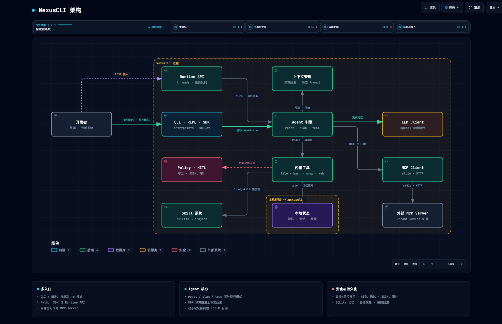

# NexusCLI

**运行在终端里的 AI Agent CLI，面向真实项目开发场景**

读写文件 · 搜索代码 · 执行命令 · 联网检索 · MCP 工具 · 记忆 · 快照 · Runtime API


[交互式架构图](docs/architecture.html) · [运行教程](TUTORIAL.md) · [快速开始](#-快速开始) · [Spec 任务包工作流](docs/spec-skill.md)

---

NexusCLI 不是一个空壳 Demo，而是按真实 CLI 产品来做：核心路径有测试覆盖，也经过本地 smoke 和真实终端运行验证。

> 第一次部署？看 [TUTORIAL.md](TUTORIAL.md)：从安装依赖、配置模型 API 到第一次跑通 Agent 任务的完整运行教程。

## 📚 目录

- [架构总览](#-架构总览)
- [功能特性](#-功能特性)
- [环境要求](#-环境要求)
- [快速开始](#-快速开始)
- [配置](#-配置)
- [权限规则](#-权限规则)
- [Hooks 生命周期钩子](#-hooks-生命周期钩子)
- [交互命令](#-交互命令)
- [内置工具](#-内置工具)
- [Plan 模式](#-plan-模式)
- [Skill 匹配与沉淀](#-skill-匹配与沉淀)
- [记忆、动态 Prompt 与上下文压缩](#-记忆动态-prompt-与上下文压缩)
- [代码索引与检索](#-代码索引与检索)
- [模型、Token 与费用](#-模型token-与费用)
- [联网工具](#-联网工具)
- [MCP](#-mcp)
- [Runtime API](#-runtime-api)
- [图片输入](#-图片输入)
- [快照](#-快照)
- [会话与恢复](#-会话与恢复)
- [任务清单](#-任务清单)
- [子代理 task 工具](#-子代理-task-工具)
- [动态工作流与 /expert](#-动态工作流与-expert)
- [定时任务（cron）](#-定时任务cron)
- [可观测性与调试](#-可观测性与调试)
- [插件系统](#-插件系统)
- [自定义斜杠命令](#-自定义斜杠命令)
- [SDK](#-sdk)
- [开发](#-开发)
- [License](#-license)

## 📐 架构总览

[](docs/architecture.html)

上图为静态快照，[交互式版本](docs/architecture.html) 支持节点搜索、路径追踪、引导式故事和深浅色主题（按 `?` 查看操作指南）。图表源文件是 [docs/architecture.json](docs/architecture.json)，交互 HTML 由 [Archify](https://github.com/tt-a1i/archify) 从该源文件生成。

一条主路径贯穿全局：**开发者** 通过 **CLI / REPL / SDK** 发起会话，**Agent 引擎** 按 `react / plan / team` 三种模式驱动，经 **上下文管理** 组装 Prompt 并压缩预算，与 **LLM** 流式对话，并通过 **内置工具** 与 **MCP** 操作本地系统和外部世界；所有危险动作都要经过 **Policy · HITL · 审计** 才会落盘。

## ✨ 功能特性

### Agent 运行模式

- 交互式终端 Agent，基于 Rich 和 prompt-toolkit 渲染；也支持单次 prompt 模式，适合脚本、管道和自动化调用
- ReAct 工具调用循环，支持 thinking、tool call、tool result、final output 和 usage 事件
- Plan-and-Execute 模式：独立 Planner 生成 DAG，按依赖批次并行执行任务
- Multi-Agent 协作模式：Planner、Worker、Reviewer、依赖调度、并行 worker、review 重试，以及可切换到独立 Plan-and-Execute 的子 Agent

### 模型与上下文

- OpenAI-compatible 流式 LLM 客户端，默认面向 DeepSeek 配置，支持 `DEEPSEEK_API_KEY` 等 provider-specific API Key
- 上下文预算与压缩：达到可用输入预算的 80% 后自动压缩旧轮次，保留近期消息和完整工具调用对；`/compact` 支持随时手动压缩并可指定保留重点
- 完整 usage、缓存命中/未命中 Token、reasoning Token 和可配置成本估算
- 本地图片和远程图片输入，并根据模型能力自动降级

### 工具与扩展

- 内置文件、Shell、grep、glob、记忆、网页搜索、网页抓取、代码搜索等工具
- 写文件/编辑 .py 文件后自动 py_compile 语法诊断，错误就地回传给模型（详见内置工具）
- bash / execute_command 支持 `run_in_background` 后台执行：立即返回任务 id 与落盘输出文件路径，`task_output` 读取尾部输出、`task_stop` 终止任务
- MCP client，支持 stdio 和 Streamable HTTP MCP server；附 Chrome DevTools MCP 配置助手
- NexusCLI 自身也可以作为 MCP server 暴露内置工具
- Skill 系统：builtin / user / project 分层、输入 Top-K 匹配、`load_skill` 当前回合懒加载，以及经 HITL 确认的 `save_skill` 流程沉淀
- 自定义斜杠命令：把 markdown 提示词放进 `~/.nexuscli/commands/` 或项目 `.nexuscli/commands/` 即可扩展 REPL 与 `-p` 模式；frontmatter 支持 `mode` / `allowed-tools` / `argument-hint`，正文可用 `$1..$9` 位置参数与 `` !`cmd` `` 输出注入
- 子代理 `task` 工具：把自包含任务委派给独立子代理执行并回收报告，支持 `run_in_background` 后台执行与回合末完成播报，内置 `general-purpose` / `explore`，也支持 `.nexuscli/agents/*.md` 自定义代理；子代理之间可用 `mailbox_post` / `mailbox_read` 文件邮箱互发消息
- 动态工作流：`/workflow run <file>.json` 按 JSON 步骤图（DAG）串行派发子代理并汇收报告，`/expert <topic>` 是同引擎的内置三步专家流程
- 插件系统：`.nexuscli/plugins/<name>/plugin.json` 声明的本地插件可一并注入自定义代理、Skill 与斜杠命令

### 记忆与持久化

- 静态项目记忆 + SQLite 动态长期记忆：元数据、去重、TTL、容量治理和相关性召回
- Agent run 前后自动创建快照，支持恢复现场
- REPL 会话自动持久化为 JSONL 转录，支持 `sessions` 列表、`-c` / `--resume` 跨进程恢复，以及 `/resume` 在会话内切换历史
- 会话级增强：`/fork [title]` 分叉会话副本、`/goal set/show/clear` 设置跨回合的长程目标、`/effort` 会话内切换推理力度、`/usage stats [N天]` 查看本地落库的近 N 天用量统计

### 安全与治理

- HITL 人工确认、命令/路径安全策略和 JSONL 审计日志
- 权限规则：config.json 里声明 `permissions.allow / deny / ask`，按 deny > ask > allow 在 HITL 之前评估
- Hooks 生命周期钩子：`SessionStart / UserPromptSubmit / PreToolUse / PermissionRequest / PostToolUse / PostToolUseFailure / Stop` 七个事件可挂 shell 命令，exit 2 或输出 JSON 即可阻断/追问；工作区级 hooks 经 sha256 指纹信任确认后才会生效
- Plan 模式：`Shift+Tab` 三态循环（default → auto → plan），plan 态只放行只读工具与判定为只读的 bash 命令，适合先审阅再执行
- `save_skill` 等沉淀类操作默认强制人工确认，模型不会静默改变后续行为

### Runtime API

- 有历史的 thread、turn、事件日志，对外提供 HTTP 接入
- 持久化后台任务：原子抢占、租约恢复、取消保护、项目隔离，支持 `react|plan|team` 模式

## 🧭 环境要求

- Python 3.11 或更新版本
- [uv](https://docs.astral.sh/uv/)
- 可选：rg（ripgrep）——doctor 会检测它；Agent 也可经 bash 工具手动使用。PATH 上装有 rg 时，内置 `grep` 工具对目录的搜索自动改由 rg 子进程加速并映射回同一结果格式；没有 rg 时自动回退纯 Python 扫描，功能不受影响
- 可选：Chrome DevTools MCP 需要 Node.js 20.19.0 LTS 或更新版本、npm/npx 和 Chrome

## 🚀 快速开始

```bash
git clone https://github.com/linixiyi/nexuscli.git
cd nexuscli
uv sync --extra dev --frozen
uv run nexuscli --help
```

启动交互模式：

```bash
uv run nexuscli
```

单次查询：

```bash
uv run nexuscli -p "帮我总结这个项目"
```

选择运行模式并输出机器可读的 usage/cost：

```bash
uv run nexuscli --mode plan -p "先读取 README，再验证项目" --json
uv run nexuscli --mode team --worker-mode plan -p "并行审计核心模块" --json
```

检查当前环境：

```bash
uv run nexuscli doctor --cwd .
```

会话持久化与恢复（REPL 对话自动保存，可跨进程继续）：

```bash
uv run nexuscli sessions       # 列出当前项目的最近会话
uv run nexuscli -c             # 继续本工程最近一次 REPL 会话
uv run nexuscli --resume <id>  # 按会话 id 恢复
```

## 🔧 配置

NexusCLI 的配置优先级如下：

1. 内置默认配置
2. `~/.nexuscli/config.json`
3. 项目级 `.nexuscli/config.json`
4. 项目级 `.env`
5. CLI 参数
6. 当前进程环境变量

可以像 Java 项目一样，把 DeepSeek Key 写到项目 `.env` 里：

```dotenv
NEXUSCLI_PROVIDER=deepseek
NEXUSCLI_MODEL=deepseek-v4-flash
DEEPSEEK_API_KEY=your_key_here
```

也可以使用 NexusCLI 通用 Key：

```dotenv
NEXUSCLI_PROVIDER=deepseek
NEXUSCLI_MODEL=deepseek-v4-flash
NEXUSCLI_API_KEY=your_key_here
```

当前支持的 provider-specific API Key 包括：

| 环境变量 | 说明 |
|---|---|
| `DEEPSEEK_API_KEY` | DeepSeek |
| `ZAI_API_KEY` | GLM 官方推荐 |
| `GLM_API_KEY` | GLM |
| `STEP_API_KEY` | StepFun |
| `KIMI_API_KEY` | Kimi |
| `ANTHROPIC_API_KEY` | Anthropic（原生 Messages API provider） |

通过命令行临时覆盖 provider 和 model：

```bash
uv run nexuscli --provider deepseek --model deepseek-v4-flash
```

连接本地 OpenAI-compatible 服务：

```bash
NEXUSCLI_PROVIDER=openai-compatible \
NEXUSCLI_BASE_URL=http://127.0.0.1:11434/v1 \
NEXUSCLI_MODEL=qwen2.5-coder \
uv run nexuscli -p "解释这个仓库"
```

原生 Anthropic provider（`NEXUSCLI_PROVIDER=anthropic`）走 Anthropic Messages API：API Key 只从 `ANTHROPIC_API_KEY` 环境变量（或既有 `llm.api_key` 配置路径）读取，默认 base_url 为 `https://api.anthropic.com`，默认上下文窗口 200K。注意两个边界：Anthropic 没有内置价格表，成本估算需要显式配置 `llm.prices`；该 provider 暂不支持图片输入，列表型消息会自动降级为文本。

两项默认关闭的可选诊断配置：

```json
{
  "telemetry": { "enabled": false },
  "llm": { "debug_dump": false }
}
```

- `telemetry.enabled`（默认 `false`）：为 `llm.chat` 与 `tool.call` 两条路径产出 OpenTelemetry span（属性带会话 trace_id）。未开启、或可选依赖 `opentelemetry` 未安装（`uv sync --extra telemetry`）时全链路 no-op，行为与没有遥测代码时完全一致
- `llm.debug_dump`（默认 `false`）：开启后每回合把 LLM 请求与响应以 JSONL 追加写入 `~/.nexuscli/debug/llm/<日期>.jsonl`，`Authorization` 等敏感请求头会脱敏为 `<redacted>`；消息正文与工具定义会原样落盘，只在可信机器上临时开启排查

两者的完整口径（trace_id 关联、span 支持边界、落盘结构与用量落库覆盖面）见 [docs/observability.md](docs/observability.md)。

Agent 工具循环的回合上限由 `agent.max_turns` 控制（默认 200，加载时最小钳到 1）：单条消息内最多执行这么多轮工具调用；到达上限而模型仍想继续时，会输出显式 warning 提示任务可能未完成，长程任务可在 config.json 的 `"agent"` 段调大该值。子代理（`task` 工具委派）不继承该配置，而是使用独立的固定上限 `SUBAGENT_MAX_TURNS`（30），不随 `agent.max_turns` 放大。加载配置时若 `max_turns` 被判定为非数值（如字符串 `"abc"`），会回退默认 200，不会让 CLI 启动失败。

## 🔐 权限规则

在 config.json 的 `permissions` 里声明 `allow` / `deny` / `ask` 三组规则，就能在 HITL 之前自动放行安全操作、追问可疑调用或直接拦截高危动作。评估优先级是 **deny > ask > allow**，用户级与项目级的同名列表按层拼接合并去重。

```json
{
  "permissions": { "allow": ["read_file", "bash(git diff:*)"], "deny": ["bash(curl | sh)"] }
}
```

另外，`bash` / `execute_command` 会先对命令串做 argv 级只读静态判定：判定为只读的命令（如 `git status`、`ls`、`cat` 这类白名单内的只读命令）在默认模式下免 HITL 审批直通执行，拿不准的命令一律回落正常审批链。直通不改变既有优先级——`deny` / `ask` 权限规则命中仍照常拦截或追问，PreToolUse hook 的阻断与 ask 提示同样优先。直通也不等于无痕：直通调用仍写审计日志（approver 记为 `readonly-rule`）。

规则写法、通配匹配、`ask` 与 `hitl_mode` 的交互等完整说明见 [docs/permissions.md](docs/permissions.md)。

## 🪝 Hooks 生命周期钩子

在 config.json 的 `hooks` 里给 `SessionStart`、`UserPromptSubmit`、`PreToolUse`、`PermissionRequest`、`PostToolUse`、`PostToolUseFailure`、`Stop` 七个生命周期事件挂 shell 命令（事件键为 camelCase）。协议：hook 进程的 stdin 收到 JSON 载荷，**exit 2 阻断**（stderr 作为拒绝原因）；exit 0 时 stdout 输出 JSON（`decision: block` 或 `hookSpecificOutput.permissionDecision: deny/ask`）同样生效；hook 返回 `allow` 只做记录，**不会绕过审批**。

```json
{
  "hooks": {
    "PreToolUse": [{ "matcher": "bash|write_file", "hooks": [{ "type": "command", "command": "python .nexuscli/hooks/guard.py", "timeout": 10 }] }]
  }
}
```

**工作区 hooks 信任确认**：项目级 `.nexuscli/config.json` 里的 hooks 是随仓库进来的代码，因此 REPL 首次遇到某个工作区的 hooks 配置时，会对整个 `hooks` 段计算 sha256 指纹并请求一次性确认（`Trust workspace hooks?`）。同意则记入 `~/.nexuscli/hooks-trust.json`（按 工作区路径+指纹 记忆，只存指纹不存任何秘密）；拒绝则本次会话禁用工作区 hooks，用户级 hooks 不受影响。之后只要 hooks 内容变化（指纹变化）就会重新确认；非交互环境一律保守拒绝。该闸门目前只覆盖交互式 REPL 入口。

JSON 载荷字段、超时语义、信任机制的存储格式与安全边界的完整说明见 [docs/hooks.md](docs/hooks.md)。

## 💬 交互命令

进入 `uv run nexuscli` 后，可以使用这些 slash commands：

```text
/help
/exit
/clear
/resume
/resume <index-or-id>
/context
/compact [focus]
/init [notes]
/memory
/memory search <query>
/memory stats
/memory delete <id>
/memory clear
/save <fact>
/config
/tools
/hitl default|auto
/policy
/audit [N]
/index [path]
/search <query>
/plan <task>
/team <task>
/team --plan <task>
/model
/model <model-id>
/model <provider> <model-id>
/usage
/usage stats [N天]
/fork [title]
/goal set <text>
/goal show
/goal clear
/effort minimal|low|medium|high
/skill
/skill list
/skill show <name>
/skill load <name>
/skill on <name>
/skill off <name>
/skill reload
/mcp
/task
/task add [--mode react|plan|team] <task>
/task cancel <task_id>
/task log <task_id>
/workflow run <file>.json
/expert <topic>
/snapshot
/snapshot clean
/restore <snapshot-id-or-index>
```

`/model` 会打开交互式模型选择器：`Tab` 或左右方向键在 `Default`、`Custom` 之间切换，上下方向键选择模型，`Enter` 立即切换当前 Agent。`Custom` 中可以选择已保存的 BYOK 模型、创建新的 DeepSeek/GLM/OpenAI-compatible 配置，或按 `d` 删除配置。自定义配置保存在权限为 `0600` 的 `~/.nexuscli/models.json`；建议填写 API Key 环境变量名，只有显式输入 API Key 时才会把密钥写入该文件。

`/skill load <name>` 把指定 Skill 的正文强制注入你的下一条消息（一次性消费）：下一回合模型会先读到该 Skill 再继续任务，适合主动确保某个技能被加载。

`/usage stats [N天]` 汇总本地 SQLite 用量库 `~/.nexuscli/usage.db`：近 N 天（缺省 7 天）的回合数、总 Token、总成本（USD/CNY）与按模型分布。落库为 best-effort：每完成一个普通回合（含自定义命令回合）记一行，值为该回合主代理自身的用量；`/init`、`/plan`、`/workflow`、`/expert` 派发的回合与单次 `-p` 模式不落库，所以统计值只反映 REPL 直连对话的用量。

`/fork [title]` 把当前会话转录复制为一个新会话并切换过去继续：新会话携带全部历史消息，元数据记录来源 `forked_from`，原会话保持不变；省略 title 时继承源会话标题。两点如实说明：会话目标（`/goal`）按 session id 存储且不随 fork 复制；fork 时会清空排队中的一次性注入（`/skill load` 的正文），新会话从干净状态开始。

`/goal set <text>` 给当前会话设置一句长程目标，之后每个回合开始前都会把 `[session goal] <目标>` 注入用户消息，直到 `/goal clear`；`/goal show` 查看。目标按会话存储在 `~/.nexuscli/goals/<session_id>.json`，只存文本。

`/effort minimal|low|medium|high` 在会话内即时切换推理力度，无参数显示当前值。该字段只对白名单内的 chat-completions provider（`openai`、`openai-compatible`、`compatible`）随请求发送 `reasoning_effort`；deepseek / glm / kimi 等其他 provider 不支持、不会发送该字段，anthropic provider 会提示不支持。切换模型（`/model`）会创建新客户端并重置 effort。

`/workflow run <file>.json` 加载 JSON 步骤图并按拓扑序串行派发子代理执行；`/expert <topic>` 是同一引擎的内置三步专家流程（调研 → 实施 → 复核）。JSON schema、校验规则与执行边界见 [docs/workflows.md](docs/workflows.md)。

## 🧰 内置工具

NexusCLI 内置了一组 Agent 可以调用的本地工具和联网工具：

| 类别 | 工具 |
|---|---|
| 文件 | `read_file`（支持 `.pdf`）· `write_file` · `list_dir` |
| 检索 | `glob` / `glob_files` · `grep` / `grep_code` · `search_code` |
| 执行 | `bash` / `execute_command` · `task_output` · `task_stop` |
| 网络 | `web_search` · `web_fetch` |
| 记忆 | `save_memory` · `search_memory` |
| Skill | `load_skill` · `save_skill` |
| 任务清单 | `todo_write` · `todo_read` |
| 子代理 | `task`（支持 `run_in_background`） |
| 子代理邮箱 | `mailbox_post` · `mailbox_read`（仅子代理注册表可见） |
| 会话 | `revert_turn` |

写文件、执行命令、远程 MCP 写操作、恢复快照等危险动作，会经过 policy、HITL 和 audit 处理。`save_skill` 也必须经过 HITL；模型可以提议沉淀，但不会静默改变后续行为。

补充说明（均以实现为准）：

- `read_file` 对 `.pdf` 后缀走 pypdf 整篇文本提取（不做分页范围），再套用与文本文件相同的行窗口。pypdf 是可选依赖，缺失时返回带安装指引的错误：`uv sync --extra pdf`（或 `pip install "nexuscli[pdf]"`）。
- `grep` 对目录搜索先探测 PATH 上的 rg：命中则由 rg 子进程加速并映射回同一 `路径:行号: 内容` 格式，rg 缺失或失败时回退纯 Python 扫描。已知语义差异：rg 会跳过二进制文件，纯 Python 路径以 `errors="ignore"` 读取一切，文本文件结果一致。
- `task` 的 `run_in_background: true` 立即返回后台任务 id 与落盘报告路径（`~/.nexuscli/bg-subagents/<task_id>.md`），不阻塞当前回合；回合结束时 REPL 会把**已**完成的后台子代理一次性播报给用户（`[bg-subagent] completed/failed ...`，不进入模型上下文）。后台子代理是进程内状态：未完成任务随 REPL 退出而终止，`task_stop` 目前不支持终止后台子代理；已完成的报告文件保留在磁盘上。
- `mailbox_post` / `mailbox_read` 是子代理之间的文件邮箱（`<cwd>/.nexuscli/mailbox/<run>/<agent>.jsonl`；run id 取 REPL 会话启动时盖的 12 位 uuid 戳，会话内 `/fork`、`/resume` 只换 writer、不重盖）：发送方由工具闭包绑定、不可伪造，`mailbox_read` 读即消费（清空收件箱）。这两个工具只注册在子代理的工具集中，主代理永远看不到。

交互模式下按 `Shift+Tab` 可在三种会话权限模式间循环切换（详见 [Plan 模式](#-plan-模式)）：

- `Default`：使用启动时的 HITL、工作区路径和命令安全策略。
- `Auto (full access)`：当前会话内不再请求审批，并关闭路径与命令守卫。
- `plan (read-only)`：只读约束态，非只读工具被硬拒绝；再次按 `Shift+Tab` 回到默认策略。

## 📋 Plan 模式

`Shift+Tab` 按 `Default → Auto (full access) → plan (read-only) → Default` 循环。plan 态不是免审批态：它会恢复启动时的 HITL 与安全策略，同时打开只读闸门——

- 执行器在权限规则、Hooks、审批之前硬拒一切非只读工具（`write_file`、`task` 等），错误信息会提示按 `Shift+Tab` 切回默认模式再执行
- `bash` / `execute_command` 按命令级判定参与该闸门：判定为只读的命令（`git status`、`ls` 等）放行，写操作命令仍被硬拒
- 只读工具（`read_file`、`grep`、`glob_files` 等）正常放行，其上的 deny 权限规则依然生效
- 被拒绝的调用不产生审批决策、不写审计、不触发 Hooks

典型用法：先切到 plan 态让 Agent 只读地调研并给出方案，审阅满意后再切回 Default 让它落地执行。

## 🎯 Skill 匹配与沉淀

Skill 按 `builtin -> user -> project` 加载，同名时后层覆盖前层：

- builtin：产品默认能力
- user：`~/.nexuscli/skills/*/SKILL.md`，跨项目复用
- project：`.nexuscli/skills/*/SKILL.md`，最贴近当前仓库并拥有最高优先级

每次用户输入先用 name、description、tags 做中英文词法/字符 n-gram Top-K 匹配，再把候选交给模型决定是否调用 `load_skill`。Skill 正文只在真正加载后进入当前 ReAct 的下一模型轮；每个并发子 Agent 都有独立 Skill 缓冲区，不会串线。

当一次成功流程具备稳定输入、明确步骤和可复用边界时，模型可以调用 `save_skill` 提议写入 project 或 user 层。该工具默认拒绝覆盖已有 Skill，并强制人工确认。

## 🧠 记忆、动态 Prompt 与上下文压缩

NexusCLI 把记忆分成三层：

- 短期记忆：当前 thread/session 的原始消息、工具调用和工具结果
- 静态长期记忆：`AGENTS.md`、`NEXUS.md`、`.nexuscli/NEXUS.md` 及自定义 prompt 文件；人工维护、可版本控制；`/init [notes]` 可让 Agent 检查工作区并生成或增量更新根 `AGENTS.md`，写入经 write_file 审批
- 动态长期记忆：按项目 scope 隔离的 SQLite 记录；包含 kind、source、importance、confidence、TTL、访问次数和内容哈希

动态记忆不会再无条件取“最近 8 条”。每个请求会按当前问题自动召回 Top-K，并把结果放进明确标注为 untrusted data 的动态 Prompt；模型觉得候选不足时，还可以调用 `search_memory` 深搜。写入端会拒绝空值/超长值，通过规范化哈希去重，并按项目容量淘汰低价值记录。

Prompt 分为可缓存的静态前缀和逐请求重建的动态后缀。静态前缀承载身份、规则和项目指令；动态后缀承载当前时间、cwd、模型、工具以及与当前问题相关的记忆。

可用输入预算按 `context_window - max_output_tokens - reserve_tokens` 计算。默认在该预算的 80% 触发压缩，压到 55% 左右，为后续输出、工具结果和无 tokenizer 估算误差留出空间。压缩摘要只属于短期会话，不会自动晋升为长期记忆。

达到压缩阈值时，压缩流程会先做一步无损的微压缩（microcompact）：把较旧回合的工具结果内容就地替换为固定占位符，消息条数与结构保持不变，最近 5 条工具结果原文保留；若清除后已回到预算内且节省达标，就不再产生摘要。清除后仍超限或节省不足时，才会继续走上述有损摘要路径。该行为随自动压缩启用，不新增配置项。

除了自动压缩，REPL 里可随时手动压缩：

```text
/compact                 # 立即压缩一次当前会话历史
/compact 权限规则的实现细节  # 指定保留重点，摘要会优先保留相关内容
```

`/compact` 走与自动压缩相同的确定性流程（不额外调用 LLM）：近端消息原样保留、旧轮次汇总为摘要，并输出压缩统计（tokens before/after 与被摘要的消息条数），方便确认压缩收益。历史为空时会友好提示，不会报错。

## 🗂 代码索引与检索

`/index [path]` 扫描工作区中的文本文件，把逐行内容写入 `.nexuscli/code_index.sqlite3` 的 `code_chunks` 表建立本地代码索引，默认跳过 `.git`、`.venv`、`node_modules` 等目录。`/search <query>` 与内置 `search_code` 工具基于同一索引做关键词检索，多个关键词按 AND 匹配，返回 `路径:行号: 代码行` 形式的结果；代码变动后重新运行 `/index` 即可刷新。

```text
/index .
/search 权限评估
```

## 💰 模型、Token 与费用

默认 provider/model 是 `deepseek/deepseek-v4-flash`。DeepSeek V4 Flash/Pro 的内置 profile 使用 1M 上下文，并带有截至 2026-07-17 的官方每百万 Token 价格；价格会变化，因此可以用 `llm.context_window` 和 `llm.prices` 覆盖，未知 OpenAI-compatible 模型应显式配置。

流式请求开启 `stream_options.include_usage`，并解析 `choices=[]` 的 usage-only 块、cache hit/miss 和 reasoning Token。REPL 用 `/usage` 查看最近一次普通 ReAct，用 `/usage stats [N天]` 查看本地落库的近 N 天汇总（默认 7 天，覆盖面边界见[交互命令](#-交互命令)），单次 CLI 用 `--json` 获取完整 usage/cost。成本以供应商返回的实际 Token 为准，不能只用“代码行数”精确推算。

## 🌐 联网工具

`web_search` 使用 DuckDuckGo HTML 搜索，返回标题、URL 和摘要。

`web_fetch` 可以抓取公开 HTTP/HTTPS 页面，并做基础正文提取。它会拒绝 `file://`、loopback、私有网络和内网地址，降低 SSRF 风险。

如果需要登录态、浏览器状态或 JS 渲染页面，建议使用 Chrome DevTools MCP。

## 🔌 MCP

NexusCLI 可以连接 MCP server，并把远端工具动态注册为 `mcp__<server-name>__<tool-name>`；也可以把自身作为 MCP server 暴露给外部客户端：`uv run nexuscli mcp serve --transport stdio` 或 `uv run nexuscli mcp serve --transport http --port 3000`。

> ⚠️ **部署边界**：作为 MCP server 运行时，NexusCLI 会在协议层强制关闭人工审批（`hitl_mode = "never"`），这意味着接入该 server 的任何客户端都获得了**无需审批的完整工具能力（包括执行命令、读写文件）**。只把 server 暴露给可信客户端；HTTP 传输默认只绑定 localhost，不要手动开放到公网。

HTTP 类 MCP server 支持 OAuth 2.0 授权码 + PKCE（public client）：在 `mcp.json` 的 server 条目里加 `auth` 段声明 `client_id` / `authorize_url` / `token_url` / `redirect_uri` / `scopes`，请求时会自动附 `Authorization: Bearer` 头，遇 401 用 refresh_token 自动刷新并重试一次；令牌只落盘在权限 0600 的 `~/.nexuscli/mcp-oauth.json`。如实说明：本切片提供的是令牌原语（PKCE 生成、换码、刷新、存储）与自动续期，**不含**交互式浏览器授权流程——首个 access token 需在 NexusCLI 之外完成授权换取后写入令牌文件。

`mcp init-chrome` 配置助手、remote-debugging 连接、OAuth 字段说明、`mcp list` 与 HTTP smoke 的完整说明见 [docs/mcp.md](docs/mcp.md)。

## 📡 Runtime API

NexusCLI 内置轻量 Runtime API，适合外部系统接入线程、turn、事件和后台任务：`uv run nexuscli serve --http --port 8080` 启动（请求头带 `x-api-key`），也可以只启动队列消费者而不暴露 HTTP：`uv run nexuscli worker --workers 2 --cwd .`。任务队列按项目目录隔离；worker 使用 SQLite 原子事务领取任务，并通过 lease/heartbeat 恢复崩溃任务。

线程 / turn / 事件与后台任务的完整端点和 curl 示例见 [docs/runtime-api.md](docs/runtime-api.md)。

## 📷 图片输入

NexusCLI 支持在 prompt 里引用图片：

```text
分析这张截图 @image:./screenshots/page.png
```

也支持绝对路径和远程图片：

```text
解释这张图 @image:/Users/me/Desktop/diagram.png
看看这个图片 @image:https://example.com/image.png
```

本地图片会自动压缩、缩放，并在需要时把透明底铺成白底，再转为 data URL。如果当前 provider/model 不支持多模态输入，NexusCLI 会自动降级为文本元信息，不会把不支持的图片 payload 发给模型。

## 📸 快照

每次 Agent run 都会尽力创建项目快照：

- `pre-turn`
- `post-turn`

快照保存在 `~/.nexuscli/snapshots/`，不会写入项目 `.git`。

REPL 中可以使用：

```text
/snapshot
/restore 1
/snapshot clean
```

## 💾 会话与恢复

REPL 的每轮对话会自动追加到 `~/.nexuscli/sessions/<id>.jsonl`（首行为会话元信息，之后每行一条消息）。只打开不对话不会产生会话文件；`/clear` 会开启一个新会话。

恢复方式：

```bash
uv run nexuscli sessions            # 列出当前项目的会话（--all 查看全部项目）
uv run nexuscli -c                  # 继续本工程最近一次会话
uv run nexuscli --resume <id>       # 按会话 id（或 id 前缀）恢复
```

会话内切换：

```text
/resume                             # 列出最近会话
/resume 2                           # 按序号切换，后续对话继续追加到该会话
/resume <id-前缀>
/fork [title]                       # 分叉当前会话为新会话并切换过去（原会话不变）
```

单次模式也支持恢复：`uv run nexuscli -p "继续刚才的任务" -c` 会把历史会话注入 react 模式（plan/team 单次模式不支持注入历史）。恢复只回放对话消息，usage/cost 从当前进程重新累计。

## ✅ 任务清单

Agent 处理多步任务时可以通过内置工具 `todo_write` 维护一份任务清单：每次提交完整列表，标记 `pending / in_progress / completed` 与优先级。清单保存在项目 `.nexuscli/todo.json`，可用 `todo_read` 读取，工具返回值即格式化后的清单状态，跨会话仍然有效。

## 🧩 子代理 task 工具

`task` 工具把一个自包含任务委派给独立的子代理：子代理有自己的历史、Skill 缓冲和工具集，跑完后只把最终报告交回主会话。内置 `general-purpose`（通用任务求解，默认值）与 `explore`（只读代码探索，检索类工具白名单，绝不修改内容）两个代理，始终可用；自定义代理放进 `~/.nexuscli/agents/*.md`（用户级）或 `.nexuscli/agents/*.md`（项目级，同名覆盖），frontmatter 声明 `name` / `description` / `tools`，正文即系统提示。

深度限制为 1：子代理不能再委派子代理；权限规则与 HITL 审批回调原样透传给子代理，plan 态下 `task` 与其他非只读工具一样被硬拒绝。每个子代理的回合上限是固定的 `SUBAGENT_MAX_TURNS`（30），不随 `agent.max_turns` 放大（见[配置](#-配置)）。

**子代理持久记忆的如实披露**：每个子代理的系统提示末尾都会附一段「持久记忆目录」约定 `~/.nexuscli/agent-memory/<agent-name>/`（按代理名隔离），提示它在跨委派之间读写 `.md` 备忘。但该目录在用户主目录下，而默认 `path_guard_enabled=true` 时子代理的文件工具被约束在工作区内，**该目录通常不可写**——提示词里因此带有降级文案：写入被路径守卫拒绝时，把想记的备忘并入最终报告即可，不要重试。也就是说持久记忆的可靠主通道仍是 `save_memory` 动态记忆，记忆目录只在路径守卫关闭（Auto 模式等）时真正可用。

后台委派、子代理邮箱、记忆目录约定的实现细节与边界见 [docs/subagents.md](docs/subagents.md)。spec 技能的 sidecar 委派合同也可直接映射到上述自定义代理机制。

## 🔀 动态工作流与 /expert

`/workflow run <file>.json` 把一个 JSON 步骤图交给编排器：工作流是 `{"steps": [{"id", "prompt", "depends_on"}]}` 形式的 DAG，加载时校验步骤 id 唯一、prompt 非空、依赖引用存在且无环（含自依赖）。执行按拓扑序**串行**派发：每一步都由内置 `general-purpose` 子代理执行（步骤不能指定代理类型），上游步骤的报告会原文注入下游步骤的提示词；某步失败会打印错误并中止剩余步骤，全部完成后逐一输出各步报告。

`/expert <topic>` 走同一引擎，内置固定的三步线性链：`research`（只读调研）→ `execute`（最小改动实施）→ `report`（复核与综合报告）。

```json
{
  "steps": [
    { "id": "research", "prompt": "只读调研 X 的现状与约束，输出要点清单", "depends_on": [] },
    { "id": "implement", "prompt": "基于调研结论完成 X 的实现", "depends_on": ["research"] },
    { "id": "verify", "prompt": "验证 X 的实现并给出结论", "depends_on": ["implement"] }
  ]
}
```

如实边界：本切片没有并行执行器与断点续跑；工作流派发的回合不计入 `/usage stats` 落库、也不注入会话目标提醒；与 `/init` 一样，用户自定义的同名命令（如自定义 `workflow` 命令）会优先于内置分支。schema、校验错误信息与派发提示词的完整说明见 [docs/workflows.md](docs/workflows.md)。

## ⏰ 定时任务（cron）

`nexuscli cron` 是**离线形态**的定时提示词注册表：任务表是手工维护的 `~/.nexuscli/cron.json`（`{"tasks": [{"id", "cron", "prompt", "enabled"}]}`），CLI 只提供读取面，没有常驻守护进程，也不会自行触发任何 LLM 调用。

```bash
uv run nexuscli cron list          # 列出任务（id、表达式、启用状态、prompt）
uv run nexuscli cron next          # 每个任务的下次触发时间（本地时间，非法表达式标 [warn]）
uv run nexuscli cron run <id>      # 原样打印该任务的 prompt（不执行）
```

`cron` 是标准 5 字段表达式（分 时 日 月 周，本地时区），支持 `*`、数字、逗号列表、区间 `a-b` 与步进 `*/n`、`a-b/n`；星期字段 0=周日，7 会规范化为 0；日/周两字段都被限制时按 vixie cron 的 OR 语义匹配。真正的触发由外部调度器驱动——让系统 cron 或 Windows 任务计划程序在计划时刻执行 `uv run nexuscli -p "$(uv run nexuscli cron run <id>)"`。表达式语法、存储容错与边界见 [docs/cron.md](docs/cron.md)。

## 🔭 可观测性与调试

- **trace_id**：每个 REPL 进程会话有一条 16 位十六进制 trace id，同会话内所有审计日志记录的 `trace_id` 字段（`/audit` 可见）与 LLM 请求的 `X-Request-ID` 头共用同一值，方便把「模型请求 ↔ 工具审计」对起来。作用域是进程内：不跨进程传播。
- **遥测（OTel）**：`telemetry.enabled` 开启且安装了可选依赖后，`llm.chat` 与 `tool.call` 两条路径产出 span（属性含 `nexuscli.trace_id` 等）。支持边界如实说明：内置实现**没有** OTLP exporter、未接真实 collector，生产路径直接使用 OTel 全局 TracerProvider（默认 NonRecordingSpan，即不导出）；需要导出时可在进程内自行注册全局 TracerProvider。仓库内的验证口径是 in-memory span exporter 的测试。
- **模型 IO 落盘**：`llm.debug_dump` 开启后每回合追加请求/响应 JSONL 到 `~/.nexuscli/debug/llm/<日期>.jsonl`，敏感头脱敏；详见[配置](#-配置)。
- **usage 落库**：普通 REPL 回合逐条写入 `~/.nexuscli/usage.db` 供 `/usage stats` 汇总；覆盖面边界（哪些回合不落库）见[交互命令](#-交互命令)。

细节与取值口径见 [docs/observability.md](docs/observability.md)。

## 🧱 插件系统

把插件目录放进项目 `.nexuscli/plugins/<name>/`，用 `plugin.json`（必填 `name`，可选 `description` / `version`）声明，即可在启动时把三类组件并入既有注册表：

```text
.nexuscli/plugins/my-plugin/
├── plugin.json              # {"name": "my-plugin", "description": "...", "version": "0.1.0"}
├── agents/*.md              # 子代理定义（并入 task 工具可用代理）
├── skills/<name>/SKILL.md   # Skill 包（并入 Skill 注册表）
└── commands/*.md            # 斜杠命令（并入自定义命令）
```

并入遵循既有的"后扫描者覆盖"链：子代理 plugin > 项目 > 用户 > 内置，Skill 与命令同理（plugin 覆盖项目层）。健壮性：`plugin.json` 缺失、损坏或非法（含非 UTF-8 字节）时，以 `[nexuscli:plugins]` 前缀警告并**只跳过该插件**，不会拖垮启动。

如实边界：仅支持项目级本地目录（无用户级插件目录、无远程/市场分发），manifest 不支持显式组件路径声明，没有 `${plugin}:` 命名空间隔离——插件组件与手写组件同名时直接覆盖。发现结果按进程缓存，坏 manifest 每进程只警告一次。详见 [docs/plugins.md](docs/plugins.md)。

## 🪄 自定义斜杠命令

把 markdown 提示词文件放进命令目录，文件名（去掉 `.md`）就是命令名：用户级 `~/.nexuscli/commands/<命令名>.md`（跨项目可用），项目级 `.nexuscli/commands/<命令名>.md`（同名时覆盖用户级；该目录默认被 gitignore，适合放个人常用命令）。REPL 输入 `/命令名` 或单次模式 `nexuscli -p "/命令名 参数"` 都会展开为提示词发给模型。

frontmatter 全部可选：`description` 显示在 `/help`，`argument-hint` 提示参数写法，`mode: react|plan|team` 让命令在指定模式下运行（运行完恢复原模式），`allowed-tools` 逗号分隔白名单（命令运行期间生效，结束后恢复）；正文支持 `$ARGUMENTS`、`$1`..`$9` 位置参数与 `` !`cmd` `` 输出注入。完整写法、占位符规则、命令守卫与示例见 [docs/slash-commands.md](docs/slash-commands.md)。

## 🐍 SDK

```python
from nexuscli.sdk import create_default_engine

engine = create_default_engine(cwd=".")
result = engine.ask_complete("解释这个项目")
print(result.text)

plan_result = engine.plan_complete("先读取 README，再总结项目结构")
team_result = engine.team_complete("让多个 Agent 并行检查核心模块")
```

## 🧪 开发

安装开发依赖：

```bash
uv sync --extra dev --frozen
```

运行检查（与 CI 完全一致）：

```bash
uv run ruff check .
uv run ruff format --check .
uv run python -m pytest
```

### 构建

发布/安装产物时使用，CI 不执行：

```bash
uv build
```

常用 smoke：

```bash
uv run nexuscli --version
uv run nexuscli --help
uv run nexuscli doctor --cwd .
uv run nexuscli --plain -p hello
```

## 📄 License

MIT. See [LICENSE](LICENSE).
